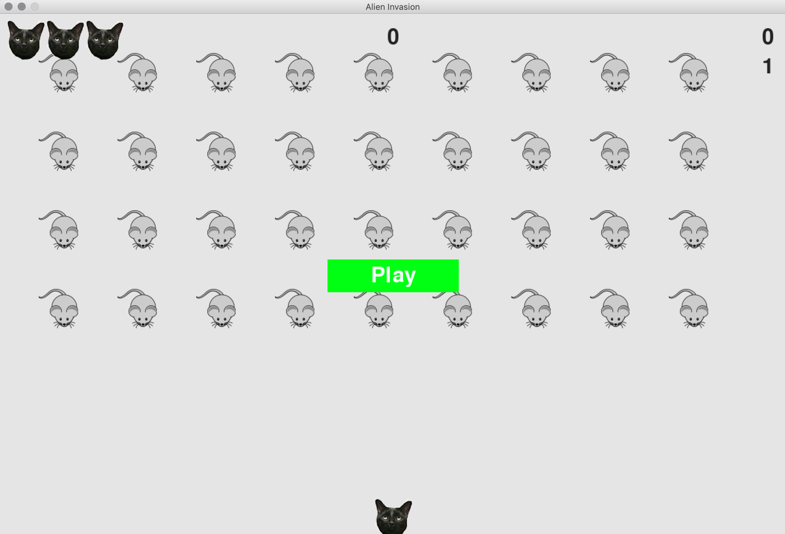

## Mouse Invasion

### Overview
The player controls a cat that moves and shoots bullets at an incoming fleet of mice that move down the screen towards the player. If the player shoots all the mice, a new stronger fleet appears. If any mice strikes the player's cat or gets past the cat the player loses a cat. The player loses the game when 3 cats have been lost.

In the code the cat is referred to as the "ship" and the mouse is the "alien".